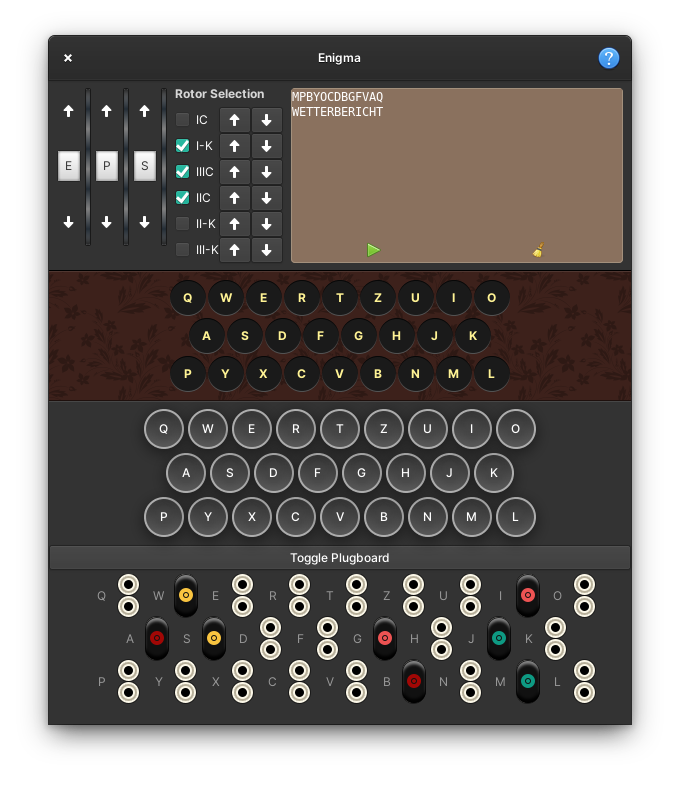

<div align="center">
  <div align="center">
    
  </div>
  <h1 align="center">Enigma</h1>
  <div align="center">
    
  </div>
  <div align="center">A classic 3-rotor Enigma Machine emulator</div>
  <div>This app is only for educational purpose. The app merely demonstrate Enigma machine. Enigma encryption is weak as per today's standards.</div>
</div>


<br/>

## Get it on elementary OS Appcenter
TBD
<!-- [](https://appcenter.elementary.io/com.github.subhadeepjasu.pebbles) -->

## Install from source
You can install Enigma by compiling it from source, here's a list of required dependencies:
 - `gtk+-3.0>=3.18`
 - `granite>=5.3.0`
 - `glib-2.0`
 - `gobject-2.0`
 - `meson`
 - `python3`


Clone repository and change directory
```
git clone https://github.com/SubhadeepJasu/enigma.git
cd enigma
```
Compile, install and start Enigma on your system

Using flatpak
```
flatpak-builder build com.github.subhadeepjasu.enigma.yml --user --install --force-clean
flatpak run com.github.subhadeepjasu.enigma
```

Natively
```
meson _build --prefix=/usr
cd _build
sudo ninja install
com.github.subhadeepjasu.enigma
```

<sup>**Based on**: [Elementary Python Template](https://github.com/mirkobrombin/ElementaryPython) by Mirko Brombin</sup>
<br>
<sup>**License**: GNU GPLv3</sup>
<br>
<sup>© Copyright 2021-2022 Subhadeep Jasu</sup>
